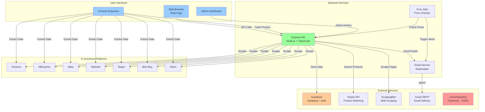
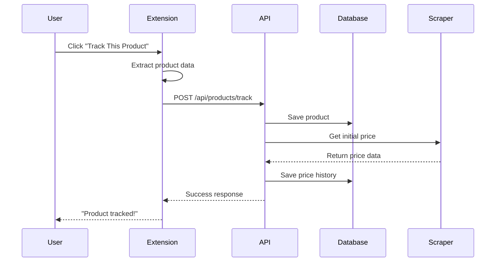
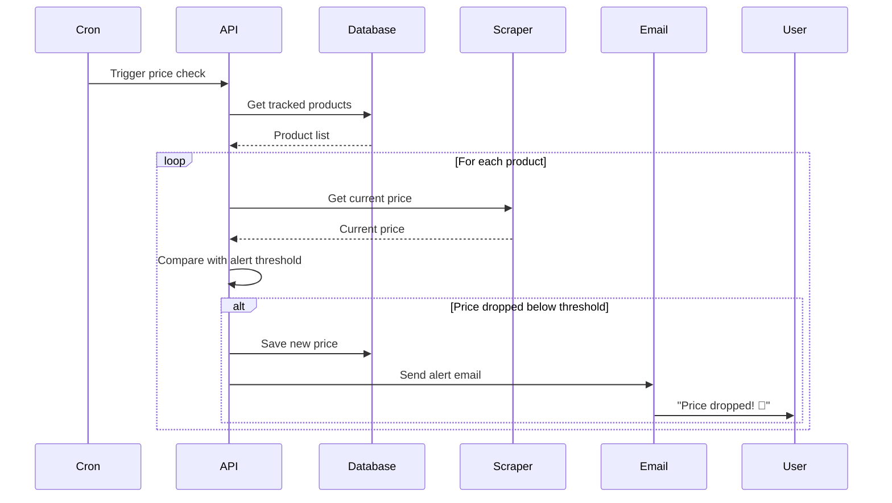
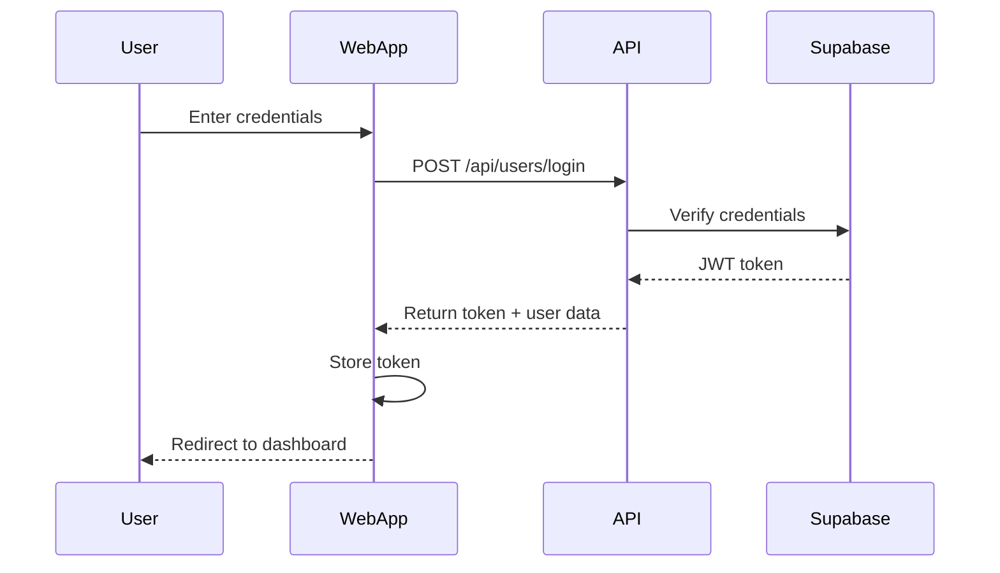
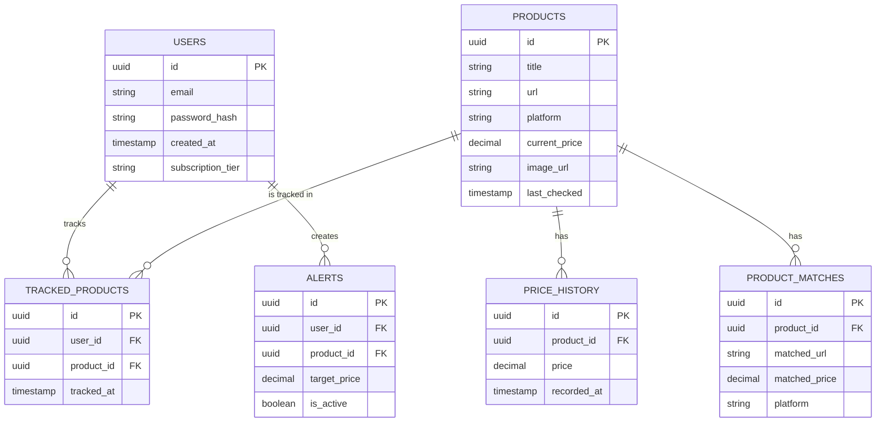
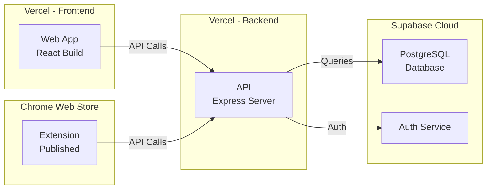

# 🏗️ Price Tracker Architecture

## System Architecture Diagram



## Data Flow

### 1. Product Tracking Flow


### 2. Price Alert Flow


### 3. User Authentication Flow


## Database Schema



## Technology Stack Breakdown

### Frontend Stack
```
React 18
├── TypeScript (Type safety)
├── Vite (Build tool)
├── React Router (Navigation)
├── Tailwind CSS (Styling)
├── Recharts (Price charts)
├── Lucide React (Icons)
├── React Hot Toast (Notifications)
└── React i18next (Internationalization)
```

### Backend Stack
```
Node.js + Express
├── TypeScript
├── Supabase Client (Database)
├── Axios (HTTP requests)
├── Cheerio (HTML parsing)
├── Playwright (Browser automation)
├── Node-cron (Scheduled tasks)
├── Nodemailer (Email)
├── JWT (Authentication)
├── Helmet (Security)
└── Express Rate Limit (API protection)
```

### Extension Stack
```
Chrome MV3
├── TypeScript
├── Webpack (Bundler)
└── Chrome APIs (Storage, Tabs, etc.)
```

## API Endpoints

### Authentication
- `POST /api/users/register` - Create new account
- `POST /api/users/login` - User login
- `POST /api/users/refresh` - Refresh JWT token
- `POST /api/users/forgot-password` - Password reset request
- `POST /api/users/reset-password` - Reset password

### Products
- `GET /api/products` - Get user's tracked products
- `POST /api/products/track` - Track new product
- `DELETE /api/products/:id` - Untrack product
- `GET /api/products/:id/history` - Get price history

### Alerts
- `GET /api/alerts` - Get user's alerts
- `POST /api/alerts` - Create new alert
- `PUT /api/alerts/:id` - Update alert
- `DELETE /api/alerts/:id` - Delete alert

### Product Matching
- `POST /api/product-matching/search` - Search for product matches
- `GET /api/product-matching/:productId` - Get matches for product

### Payments (To Be Implemented)
- `POST /api/payments/create-checkout` - Create checkout session
- `POST /api/payments/webhook` - Handle payment webhooks
- `GET /api/payments/subscription` - Get subscription status

## Deployment Architecture



## Environment Variables

### Backend (api/.env)
```bash
# Database
SUPABASE_URL=https://...
SUPABASE_SERVICE_ROLE_KEY=...
SUPABASE_ANON_KEY=...

# Authentication
JWT_SECRET=...

# Email
GMAIL_USER=...
GMAIL_APP_PASSWORD=...

# Scraping
SERPER_API_KEY=...
SCRAPINGBEE_KEY=...

# Payments (To Add)
LEMONSQUEEZY_API_KEY=...
LEMONSQUEEZY_STORE_ID=...
```

### Frontend (web-app/.env)
```bash
VITE_API_BASE=https://...
VITE_SUPABASE_URL=https://...
VITE_SUPABASE_ANON_KEY=...
```

## Security Features

1. **Authentication**: JWT tokens with Supabase Auth
2. **Rate Limiting**: Prevents API abuse
3. **Helmet**: Security headers
4. **CORS**: Controlled cross-origin requests
5. **Environment Variables**: Secrets not in code
6. **Row Level Security**: Database-level permissions

## Performance Optimizations

1. **Caching**: In-memory cache for product matches
2. **Compression**: Gzip compression on API responses
3. **Lazy Loading**: React components loaded on demand
4. **Database Indexing**: Fast queries on Supabase
5. **CDN**: Static assets served via Vercel CDN

---

This architecture supports:
- ✅ Scalability (serverless deployment)
- ✅ Security (multiple layers)
- ✅ Performance (caching + CDN)
- ✅ Reliability (managed services)
- ✅ Maintainability (TypeScript + modular code)
